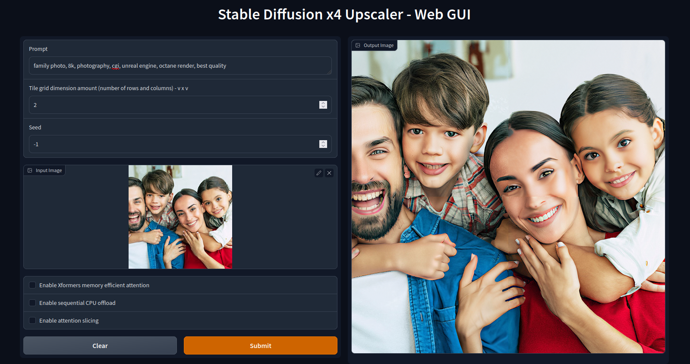

# Stable Diffusion x4 Upscaler - Web UI




This is a Gradio Web UI version of the official SD x4 Upscaler (https://huggingface.co/stabilityai/stable-diffusion-x4-upscaler).

The Stable Diffusion x4 Upscaler is a powerful tool for upscaling images with impressive results. However, it requires a high VRAM GPU to function, making it difficult for users with consumer GPUs to use.

To address this issue, I've designed a Gradio Web UI that slices the image into tiles, using a grid of squared sizes, to enable users with consumer GPUs to use the upscaler. The user can select a grid size of 1x1, 2x2, or 3x3, which results in 1, 4, or 9 tiles, respectively.

Please feel free to open an issue or make a pull request if you would like to help optimize the app to make lower use of VRAM or improve the Gradio GUI.
## Usage
### Requirements

Before running the app, you need to install the required packages by running the following commands:

```
git clone https://github.com/Subarasheese/sd-x4-wui
cd sd-x4-wui
virtualenv venv
source venv/bin/activate
pip install -r requirements.txt
```
### Running the App

After installing the required packages, run the app with the following command:

```
source venv/bin/activate
python gradio_gui.py
Run the local URL on the browser (probably http://127.0.0.1:7860)
```
## Image Generation

When generating images, keep in mind that the prompt will be applied to each individual tile, not the entire image. For example, if you enter "man/woman," each tile will contain only a part of the skin of the person. Focus on quality tags, such as 8k, best quality, photography, cgi, and unreal engine.

## To-Do List

Here are some items on our to-do list that we plan to address in the future:

- [ ] Add a "save image" button. Also, add another button to save a half-sized version of the image, which reduces tiling artifact while still increasing the original resolution.
- [ ] Fix Xformers, which are currently implemented but not working for some reason, at least on my end.
- [ ] Make additional optimizations that would enable users with low VRAM to upscale without aggressively increasing the number of tiles.
- [ ] Create a Colab training notebook.
- [ ] Find a way to make the tiles blend seamlessly, with no edges or artifacts.
- [ ] Make a port to the AUTOMATIC1111 Stable Diffusion web UI.

